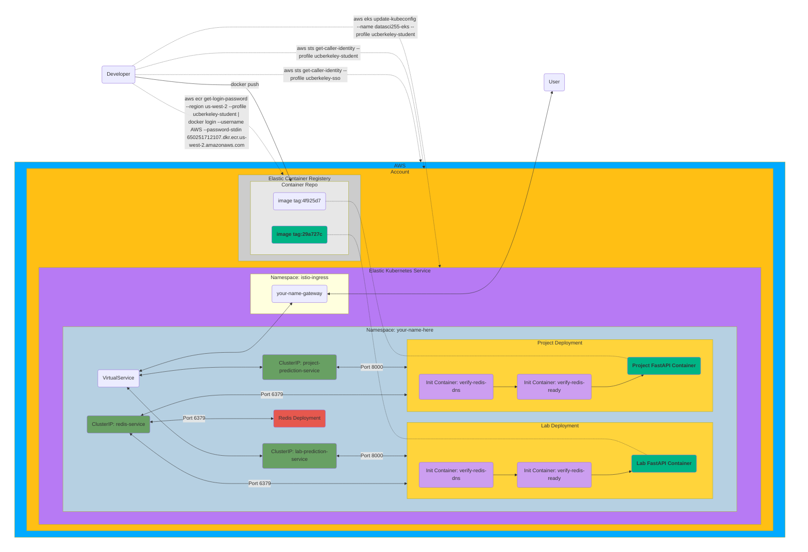

# Final Project: Full End-to-End Machine Learning API

<!-- markdownlint-disable MD028 -->

<p align="center">
    <!--Hugging Face-->
        
    <!--PLUS SIGN-->
        
    <!--FASTAPI-->
        
    <!--PLUS SIGN-->
        
    <!--REDIS LOGO-->
        
    <!--PLUS SIGN-->
        
    <!--KUBERNETES-->
        
    <!--PLUS SIGN-->
        
    <!--AWS-->
        
    <!--PLUS SIGN-->
        
    <!--k6-->
        
    <!--PLUS SIGN-->
        
    <!--GRAFANA-->
        
</p>

- [Final Project: Full End-to-End Machine Learning API](#final-project-full-end-to-end-machine-learning-api)
  - [Things To Know](#things-to-know)
  - [Base Requirement](#base-requirement)
  - [Project Overview](#project-overview)
  - [Project Objectives](#project-objectives)
  - [Helpful Information](#helpful-information)
    - [Model Background](#model-background)
    - [Pydantic Model Expectations](#pydantic-model-expectations)
    - [Poetry Dependancies](#poetry-dependancies)
    - [Git Large File Storage (LFS)](#git-large-file-storage-lfs)
  - [Submission](#submission)
  - [Grading](#grading)
  - [Time Expectations](#time-expectations)

## Things To Know

> [!Caution]
> You will be deploying 3 services in total; `project`, `lab`, and `redis`. You should expect 3 services, 3 deployments, 2 horizontal pod autoscalers, and a single virtual service that will route based on the path. The only incremental addition is the project. Extend your existing `kustomize` overlay to deploy the `project`. You can copy your `kustomize` scripts from `lab` and extend to add the project. This will stop you from impacting your `lab4` autograder.

> [!Caution]
> You will need to install `git-lfs` in order to pull the model locally. <https://git-lfs.github.com/>. You will be pulling your model from `huggingface`. You can see a tutorial for pulling <https://huggingface.co/docs/hub/en/repositories-getting-started#cloning-repositories>.

> [!Caution]
> `torch` does not support Intel-based Mac's anymore. If you have migrated from an intel-based mac at some point to a new ARM-based Mac you might run into issues. A simple test to verify this is to run the following `poetry run python -c "import platform; print(platform.machine())"` This should show `arm64` for a mac to work as expected. Similarly `arm64` is not supported on Windows, a recent student had issues with a new Microsoft Surface Pro; such computers are not supported by `torch`. If you have this issue the best solution is to launch a virtual machine (either on your computer or in a cloud environment) and do the work on a virtual machine.

> [!NOTE]
> The model for your `lab` was roughly `1 MB`, while the model for the `project` is `1 GB`. Think about the implications this has for the resources required for your application to run given you have to load your model. Adjust limits accordignly without wasting resources.

> [!NOTE]
> One requirement of the project is that the system is fast when scaling. This implies that new pods are coming online. If the model has to be pulled from `huggingface`, and that model is quite large (`~500 MB`), then it will take a long time for a new pod to come online. During scaling events such as when `k6` is being run this will lead to a significant amount of latency as existing pods won't be able to keep up with the load. You should bake the model into the image similarly to how we have done for the `lab`. The best practice to handle this would be to mount the model from shared storage instead, but that's a lot of extra work for students to understand.

> [!NOTE]
> The training script is provided as a reference. You will not need to run the training yourself as it requires significant GPU resources.

> [!NOTE]
> Your image will be fairly large due to `torch` and the model being roughly 500 MB each. You may run into some networking issues pushing to `ecr`.

## Base Requirement

Expose both your `project` and `lab` over your virtual service to show that we can support multiple services

Since we wrote the `lab` where all endpoints are `/lab` by mounting and the project is setup the same way except for `/project` we can simply route based on the url path to a particular service.

Provided is a minimal Virtual Service definition that you can extend for multiple matches.

```{yaml}
apiVersion: networking.istio.io/v1beta1
kind: VirtualService
metadata:
  name: external-access
  namespace: winegarj
spec:
  gateways:
    - istio-ingress/winegarj-gateway
  hosts:
    - winegarj.mids255.com
  http:
    - match:
        - uri:
            prefix: "/lab"
      route:
        - destination:
            host: lab-prediction-service
            port:
              number: 8000
```

## Project Overview

The goal of `project` is to take everything you have learned in this class and deploy a fully functional prediction API accessible to end users.

You will:

- Utilize `Poetry` to define your application dependancies
- Package up an existing NLP model ([DistilBERT](https://arxiv.org/abs/1910.01108)) for running efficient CPU-based sentiment analysis from `HuggingFace`
- Adjust your `redis` cache prefix key to `fastapi-cache-project`
- Create a `FastAPI` application to serve prediction results from user requests
- Test your application with `pytest`
- Utilize `Docker` to package your application as a logic unit of compute
- Cache results with `Redis` to protect your endpoint from abuse
- Deploy your application to `AWS` with `Kubernetes`
- Use `k6` to load test your application
  - `k6 run -e NAMESPACE=${NAMESPACE} --summary-trend-stats "min,avg,med,max,p(90),p(95),p(99),p(99.99)"  load.js`
- Use `Grafana` to visualize and understand the dynamics of your system

Below is an outline of the overall architecture:



## Project Objectives

- [ ] Write pydantic models to match the specified ***input*** model

    ```javascript
    {
        "text": ["example 1", "example 2"]
    }
    ```

- [ ] Write pydantic models to match the specified output model

    ```javascript
    {
        "predictions":
        [
            [
                {
                    "label":"POSITIVE",
                    "score":0.7127904295921326
                },
                {
                    "label":"NEGATIVE",
                    "score":0.2872096002101898
                }
            ],
            [
                {
                    "label":"POSITIVE",
                    "score":0.7186233401298523
                },
                {
                    "label":"NEGATIVE",
                    "score":0.2813767194747925
                }
            ]
        ]
    }
    ```

- [ ] Pull the [following model](https://huggingface.co/winegarj/distilbert-base-uncased-finetuned-sst2) locally to allow for loading into your application. Put this at the root of your project directory for an easier time.
  - [x] Add the model files to your `.gitignore` since the file is large, and we don't want to manage `git-lfs` and incur costs for wasted space. `HuggingFace` is hosting the model for us.
- [ ] Create and execute `pytest` tests to ensure your application is working as intended
- [ ] Build and deploy your application locally (Hint: Use `kustomize`)
- [ ] Push your image to `ECR`.
  - [ ] Use a prefix based on your namespace, and call the image `project`
- [ ] Deploy your application to `EKS` similar to lab 4
  - [ ] **Make sure to adjust your virtual service to expose both `project` and `lab`**
- [ ] Run `k6` against your application with the provided `load.js`
- [ ] Capture screenshots of your `grafana` dashboard for your service/workload during the execution of your `k6` script
- [ ] Feel extremely proud about all the learning you went through over the semester and how this will help you develop professionally and enable you to deploy an API effectively during your capstone. There is much to learn, but getting the fundamentals are key.

## Helpful Information

### Model Background

Please review the `train.py` to see how the model was trained and pushed to `HuggingFace` as an artifact store for models and their associated configuration.
This model took 5 minutes to transfer learn on 2x A4000 GPUs with a 256 batch size, taking 15 GB of memory on each GPU.

Training on CPUs would likely have taken several days. The given implementation allows for maximum text sequences of `512` tokens for each input.
***Do not try to run the training script on your local machine.***

Model loading examples are provided in `example.py`. In this file, we directly load the model from `HuggingFace`; however, this is extremely inefficient given the size of the underlying model (256 MB) for a production environment.
We will pull down the model locally as part of our build process.

Model prediction pipelines are included in the `transformers` API provided by `HuggingFace,` which dramatically reduces the complexity of the Inferencing application.
An example is provided in `mlapi/example.py` and is instrumented already in your `main.py` application.

### Pydantic Model Expectations

We provide you with a pytest file, `test_mlapi.py`, which has the structure of how you should design your pydantic models.
You will have to do some reverse engineering so that your model matches our expectations.

### Poetry Dependancies

Do not run `poetry update` it will take a long time due to the handling of `torch` dependencies.
Do a `poetry install` instead.

### Git Large File Storage (LFS)

You might need to install `git lfs` <https://git-lfs.github.com/>

## Submission

All code will be graded off your repo's `main` branch and `EKS` deployment.
No additional forms or submission processes are needed.

## Grading

All items are conditional on a `95%` cache rate, and after a `10 minute` sustained load:

|                  **Criteria**                  |                          **0%**                          |                            **50%**                            |                        **90%**                         |                   **100%**                   |
|:---------------------------------------------: |:-------------------------------------------------------: |:------------------------------------------------------------: |:-----------------------------------------------------: |:-------------------------------------------: |
| *Functional API*                               | No Endpoints Work                                        | Some Endpoints Functional                                     | Most Endpoints Functional                              | All Criteria Met                             |
| *Caching*                                      | No Attempt at Caching                                    | Caching system instantiated but not used                      | Caching system created but missing some functionality  | All Criteria Met                             |
| *Kubernetes Practices*                         | No Attempt at Deployments                                | Deployments exist but lack key functionality                  | Kubernetes deployment mostly functional                | All Criteria Met                             |
| *Testing*                                      | No Testing is done                                       | Minimal amount of testing done. No testing of new endpoints.  | Only "happy path" tested and with minimal cases        | All Criteria Met                             |
| *Passing Provided Tests*                       | Pydantic model does not adhere to our given pytest file  | Pydantic model somewhat passes pytest file                    | Pydantic model mostly passes pytest file               | All Criteria Met                             |
| *Model Loading*                                | Model loads from hugging face on API instantiation       | N/A                                                           | N/A                                                    | Model is loaded into the container at build  |
| *Predict Endpoint Performance*                 | Endpoint performs at 1 request/second                    | Endpoint performs at 5 requests/second                        | Endpoint performs at 9 request/second                  | Endpoint performs at 10 requests/second      |
| *Predict Endpoint Latency @ 10 Virtual Users*  | p(99) < 10 seconds                                       | p(99) < 5 seconds                                             | p(99) < 3 seconds                                      | p(99) < 2 seconds                            |

## Time Expectations

This project will take approximately ~10 hours.
